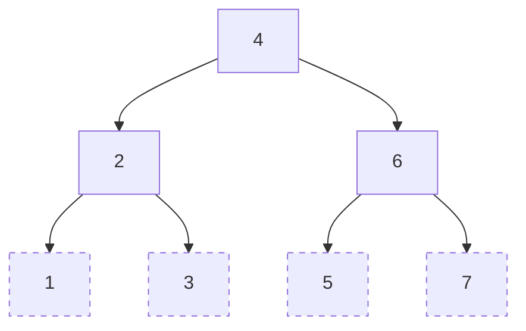
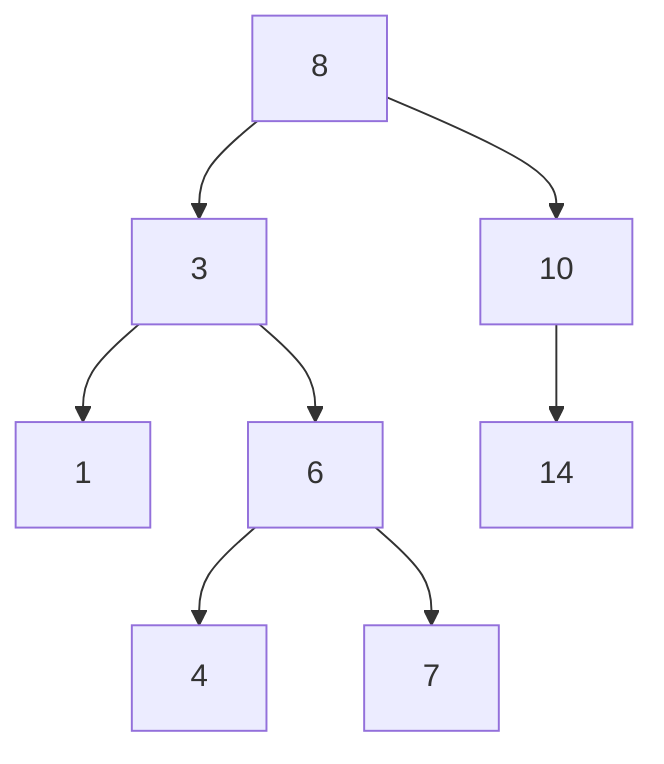
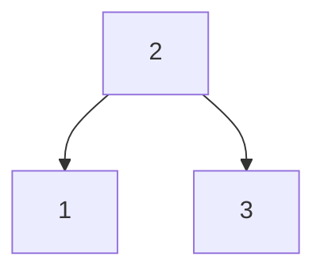
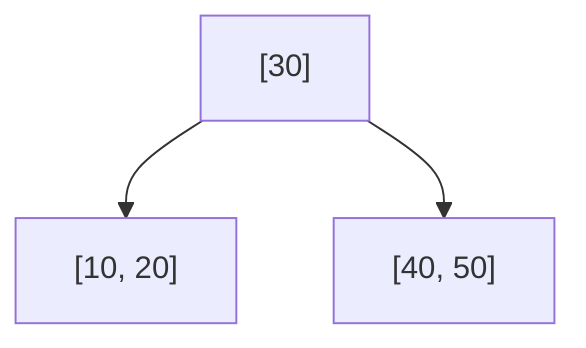

## 1️⃣ 线索二叉树（Threaded Binary Tree）🧵

### ✅ 通俗解释：

普通二叉树很多结点的左右指针是空的，线索二叉树就**把这些“空指针”利用起来，指向前驱/后继节点**，加快遍历速度。

### 📘 应用场景：

* 提高中序遍历效率（不用递归或栈）
* 适合频繁遍历、不修改结构的树

### 🖼️ 示例图：

> 虚线表示“线索”连接而不是普通子树连接。

---

## 2️⃣ 最优二叉树（哈夫曼树 Huffman Tree）📦

### ✅ 通俗解释：

**构建带权路径长度最短的二叉树**，常用于**数据压缩**（比如哈夫曼编码），把频率高的字母放在更靠近根的位置，节省整体存储。

### 📘 应用场景：

* 哈夫曼编码
* 文件压缩工具（如zip）
* 压缩比：（原始编码长度 - 哈夫曼编码长度）/ 哈夫曼编码长度

### 🧠 示例权值：

A(5), B(9), C(12), D(13), E(16), F(45)

> 先将最小的两个节点合并，再不断合并直到生成树，保证路径总权最小。

---

## 3️⃣ 二叉排序树（Binary Search Tree，BST）🔍

### ✅ 通俗解释：

一种满足**左小右大**规则的树，左子树 < 根 < 右子树，适合**快速查找、插入、删除**。

### 📘 应用场景：

* 实现动态查找表
* 数据快速查找结构

### 🖼️ 示例图：

---

## 4️⃣ 平衡二叉树（AVL树）⚖️

### ✅ 通俗解释：

一种特殊的二叉排序树，保证**任意节点左右子树高度差不超过1**，避免一边长一边短造成查找变慢。

### 📘 应用场景：

* 有大量插入/删除的查找结构
* 提高BST效率（避免退化为链表）

### 🎯 举个不平衡例子：

插入顺序 1→2→3 会变成链表（退化）

### 🎯 平衡后：

---

## 5️⃣ B树（B-Tree）📚

### ✅ 通俗解释：

**多路平衡查找树**，一个节点可以有多个孩子，专为**磁盘读写设计**，常用于**数据库、文件系统索引**。

### 📘 应用场景：

* MySQL、MongoDB索引结构
* 操作系统文件系统（如ext4）

### 🎯 举例说明（B树阶为3）：

* 每个节点最多两个键值，最多三个孩子

---

## ✅ 总结对比表格：

| 名称    | 特点               | 应用场景       |
|-------|------------------|------------|
| 线索二叉树 | 空指针→前驱/后继，提高遍历效率 | 非递归遍历      |
| 哈夫曼树  | 带权路径最短           | 数据压缩       |
| 二叉排序树 | 左小右大，动态查找表       | 快速查找       |
| 平衡二叉树 | 任意节点左右高差 ≤1      | 高效动态查找结构   |
| B树    | 多路平衡树，磁盘友好结构     | 数据库/文件系统索引 |

---
