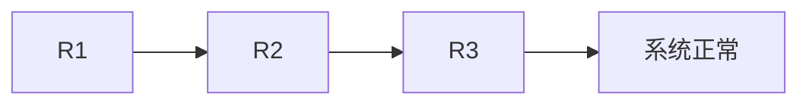
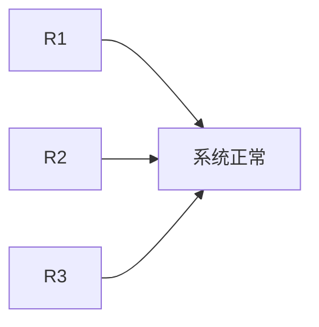

计算机可靠性是衡量计算机系统在**一定时间内**和**特定环境下**执行其预期功能的能力。可靠性通常用**可靠度（R）**表示，它是系统在某个时间点仍然正常工作的概率。  

---

## **计算机系统的可靠性**  
### **影响计算机可靠性的因素**
- **硬件可靠性**：CPU、存储器、硬盘、电源等组件的寿命和故障率。
- **软件可靠性**：软件的代码质量、bug 率、错误恢复能力。  
- **环境因素**：温度、湿度、电磁干扰等可能影响系统稳定性。  
- **人为因素**：运维管理、误操作等可能导致系统故障。  

---

## **可靠性计算公式**
假设组件的可靠度为 $ R $，则：
- 串联系统（Series System）：**所有组件必须都正常工作**，系统才能正常工作。  
- 并联系统（Parallel System）：**只要有一个组件正常**，系统就能正常工作。  

### **（1）串联系统的可靠度计算**
如果 **n 个组件串联**，系统可靠度为：
$$
R_{\text{series}} = R_1 \times R_2 \times ... \times R_n
$$
📌 **示例**：  
如果 3 个组件的可靠度分别是 0.9、0.8、0.95，则：
$$
R_{\text{series}} = 0.9 \times 0.8 \times 0.95 = 0.684
$$
👉 可靠度 **降低**，因为只要一个组件坏了，整个系统就失效。

📌 **Mermaid 图示**（串联系统）：

---

### **（2）并联系统的可靠度计算**
如果 **n 个组件并联**，只要有一个组件正常，系统就能正常运行：
$$
R_{\text{parallel}} = 1 - (1 - R_1) \times (1 - R_2) \times ... \times (1 - R_n)
$$
📌 **示例**：  
如果 3 个组件的可靠度分别是 0.9、0.8、0.95，则：
$$
R_{\text{parallel}} = 1 - (1 - 0.9) \times (1 - 0.8) \times (1 - 0.95)
$$
$$
= 1 - (0.1 \times 0.2 \times 0.05) = 1 - 0.001 = 0.999
$$
👉 可靠度 **大幅提高**，因为只要有一个组件没坏，系统仍然可用。

📌 **Mermaid 图示**（并联系统）：

---

## **🎯 总结**
| **系统类型** | **计算公式**                                                     | **特点**                    |
|----------|--------------------------------------------------------------|---------------------------|
| **串联系统** | $ R_{\text{series}} = R_1 \times R_2 \times ... \times R_n $ | **可靠度下降**，任意一个组件坏了，系统失效   |
| **并联系统** | $ R_{\text{parallel}} = 1 - \prod (1 - R_i) $                | **可靠度提高**，只要有一个组件正常，系统仍可用 |

### **相关名词**
- **λ**：故障率，单位时间内发生故障的概率。
- **MTBF**：平均无故障时间，表示系统在两次故障之间的平均工作时间，相关公式：
$$
\lambda = \frac{1}{MTBF}
$$
- **MTRF**：平均修复时间，表示系统发生故障后恢复正常工作的平均时间。
- **可用性（A）**：系统在某个时间段内可用的概率，通常用公式表示为：
$$
A = \frac{MTBF}{MTBF + MTRF}
$$