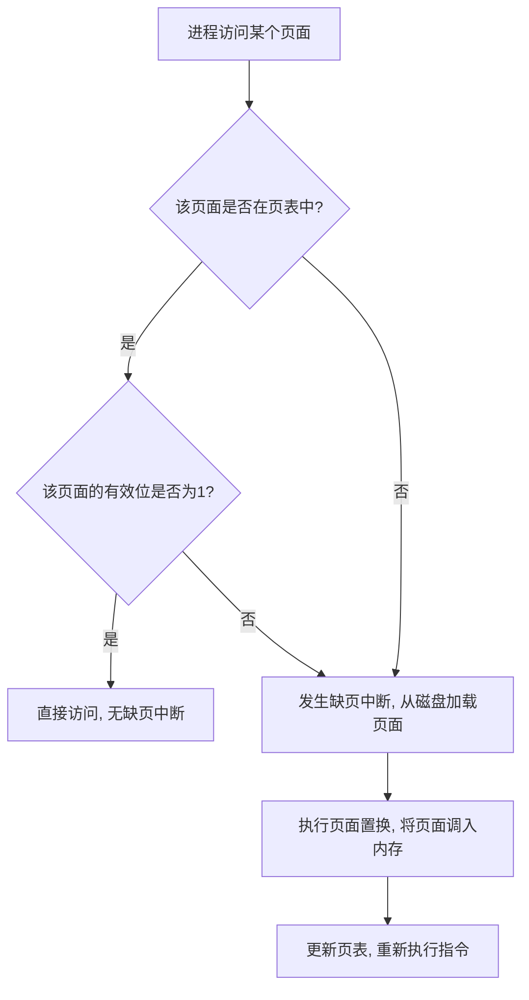

### 📌 **缺页中断（Page Fault）是什么？**  
在**虚拟存储器**中，进程运行时使用**虚拟地址**，而实际访问的是**物理内存**。如果进程访问的**页面**当前**不在内存中**，就会触发 **缺页中断（Page Fault）**，然后操作系统会将**缺失的页面**从**外存（磁盘）**加载到内存。  

---

### 🎯 **缺页中断何时发生？**
✅ 当进程访问一个**不存在于物理内存**的**虚拟页面**时，会触发**缺页中断**，一般在以下情况发生：
1️⃣ **进程首次访问某个页面** 🆕：  
   - 进程刚刚启动时，代码和数据还未加载到内存，访问这些数据会触发缺页中断。  
   
2️⃣ **进程访问的页面被换出（被其他页面替换出内存）** 🔄：  
   - 如果物理内存满了，OS 需要**页面置换算法**（如 FIFO、LRU）将某些页面换出到磁盘。当进程再次访问这个页面时，就会触发缺页中断。  

3️⃣ **访问尚未分配的虚拟地址** ❌：  
   - 如果进程访问的地址在其地址空间中**未分配**，会导致**缺页中断**，如果 OS 允许**按需分配**，则会分配新的页面，否则会触发**段错误（Segmentation Fault）**。  

---

### 📍 **如何判断页面置换时是否发生缺页中断？**
在**页面置换（Page Replacement）**过程中，可以通过**页表（Page Table）**和**标志位**来判断是否发生缺页中断：

✅ **判断依据**：
- **页表项中的“有效位（Valid Bit）”**：  
  - **有效位=0**：表示页面不在内存，访问该页面会触发缺页中断。  
  - **有效位=1**：表示页面在内存，不会发生缺页中断。

- **查找页面时，是否在页表中找到对应的物理页框**：
  - **如果找到** ✅ → 直接访问，不发生缺页中断。  
  - **如果未找到** ❌ → 缺页中断，加载页面。  

✅ **示例情况**
| **访问的页面** | **页表有效位** | **页面是否在内存** | **是否缺页中断** |
|--------------|------------|----------------|----------------|
| Page A       | 1          | ✅ 在内存中   | ❌ 否 |
| Page B       | 0          | ❌ 不在内存   | ✅ 是 |
| Page C       | 0          | ❌ 不在内存   | ✅ 是 |
| Page D       | 1          | ✅ 在内存中   | ❌ 否 |

---

### 🎯 **Mermaid 绘制缺页中断判断流程**

---

### 🎯 **总结**
✅ **缺页中断发生的条件**：
- 进程访问的页面**不在物理内存**（页表有效位 = 0）。  
- 可能由于**按需分页**或**页面被换出**导致。  

✅ **判断是否缺页中断的方法**：
1. **查页表** 🔍：查看**页面是否存在**，如果不存在，就发生缺页中断。  
2. **检查有效位** 🏷️：有效位 = 0 → 发生缺页中断，进行**页面置换**。  

✅ **Mermaid 图示** 🎨 展示了完整流程，让判断过程更直观 💡。  

这样理解是不是更清晰了呢？😃💻