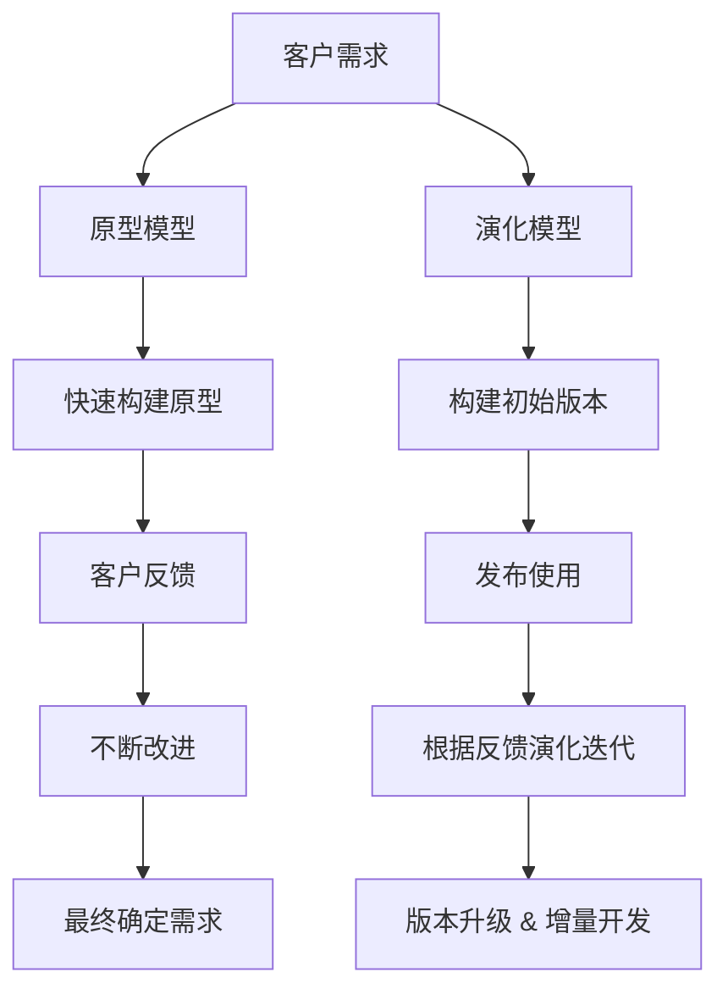

这是软件工程中非常经典的两个过程模型问题！我们来通俗讲讲 **演化模型** 和 **原型模型** 的区别，以及各自适合的场景 🔍

---

## 🧬 一图速览（mermaid）：

---

## 📦 模型对比表格

| 特点 🔍   | 🧪 原型模型（Prototype Model） | 🛠️ 演化模型（Evolutionary Model） |
|---------|--------------------------|------------------------------|
| 🚩目标    | 快速验证和澄清用户需求              | 持续迭代开发和完善系统                  |
| 🧱 初始开发 | 快速构建一个“看得见”的原型           | 构建可运行但简单的系统                  |
| 🔁 迭代重点 | 主要用于获取用户反馈，**不断改进原型设计**  | 系统本身逐步演化为最终产品，**功能持续增强**     |
| 🎯 最终结果 | 原型最终被**丢弃**，用于辅助需求确认     | 每一次迭代都**构建在真实系统上**           |
| 🤔 适用场景 | 需求不明确、用户无法明确表达需求         | 需求经常变化、系统较复杂、需要持续交付          |
| 📋 成本控制 | 原型开发开销小、但可能浪费            | 开发成本较高，但最终可控                 |
| 🧩 示例   | UI 原型设计、交互演示             | 敏捷开发、持续交付                    |

---

## 🧠 简单理解

- **原型模型** = “先画个草图让你看看你喜不喜欢” ✏️  
  → **重点是试错与理解需求**，不是做成品。

- **演化模型** = “我先给你一个能用的小版本，然后持续升级它” 🔄  
  → **重点是逐步完善、持续集成**，最终做出完整产品。

---

## 🚀 举个例子：

你要做一个网站：

- **原型模型**：  
  → 先画一个页面草图（UI设计），让客户看看效果，客户说“按钮太小”，你就改；直到满意为止，才开始写真正的代码。

- **演化模型**：  
  → 先上线一个最基础的版本（登录 + 首页），之后每次迭代新增功能（比如消息系统、评论功能、后台管理），版本不断升级，最后变成一个完整网站。

---

如果你还在准备软设考试📚，这两者的区别可是高频考点哟！需要我总结成一段记忆口诀也可以 😊