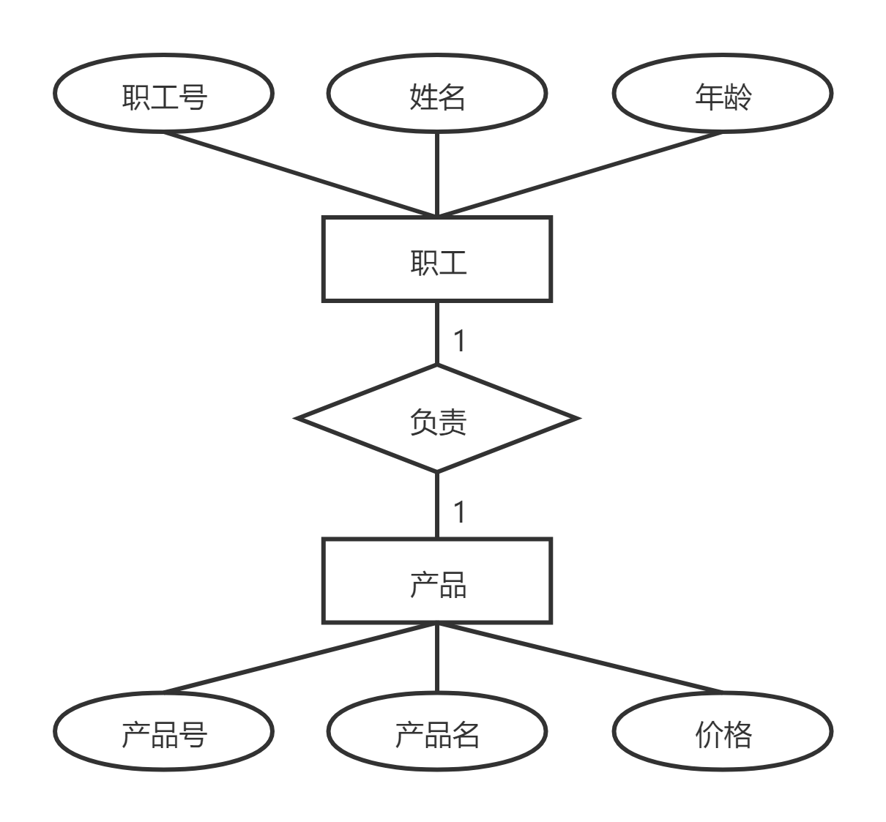
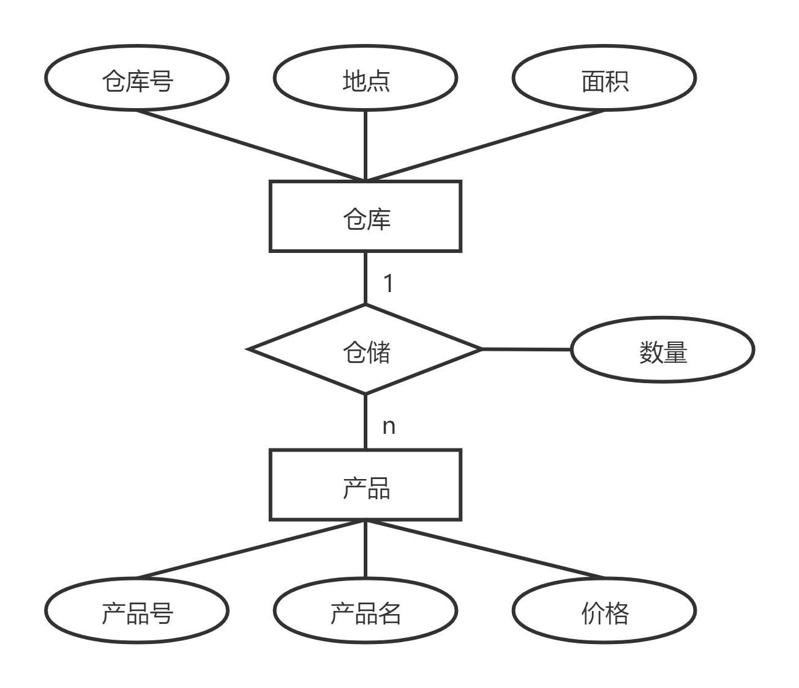
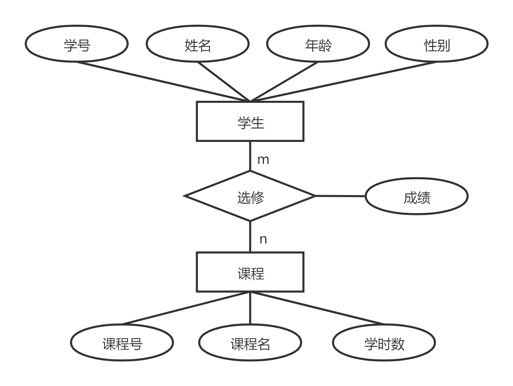
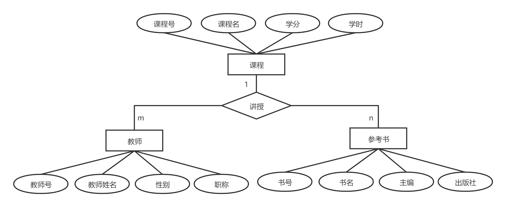
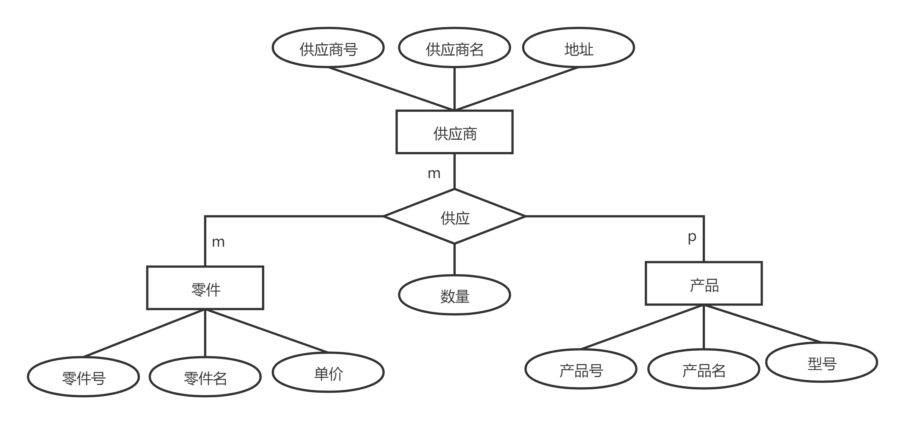

# 🌟 实体集的转换规则

## 🏛️ 一、实体集的转换规则
- **一个实体集转换为关系模型中的一个关系**
- **实体的属性** → 关系的属性
- **实体的码** → 关系的码
- **关系的结构** = 关系模式

---

## 🔄 二、实体集间联系的转换规则
### 1️⃣ 1:1 联系的转换方法
<div style="text-align: center;">
  
</div>

#### ✅ 方法一：独立关系
- **将 1:1 联系转换为一个独立的关系**
- 该关系包含：
  - 与该联系相连的**实体的码**
  - **联系本身的属性**
  - 每个实体的码均是该关系的**候选码**

**示例：**
```text
职工（__职工号__，姓名，年龄）
产品（__产品号__，产品名，价格）   
负责（__职工号__，__产品号__）
```

#### 🔄 方法二：合并到某一端实体
- **选择一端的实体集，将联系合并进该关系**
- 在被合并关系中**增加属性**：
  - **联系的属性**
  - **另一个实体的码**

**示例：**
```text
（合并 “负责” 与 “职工”）
职工（__职工号__，姓名，年龄，产品号）
产品（__产品号__，产品名，价格）
```

```text
（合并 “负责” 与 “产品”）
职工（__职工号__，姓名，年龄）
产品（__产品号__，产品名，价格，职工号）
```

---

### 2️⃣ 1:n 联系的转换方法
<div style="text-align: center;">
  
</div>

#### ✅ 方法一：独立关系
- **转换为一个独立的关系**
- 该关系包含：
  - **1 端实体的码**
  - **n 端实体的码**
  - **联系的属性**
- **n 端实体的码** 为该关系的 **主键**

**示例：**
```text
仓库（__仓库号__，地点，面积）
产品（__产品号__，产品名，价格）
仓储（__产品号__，__仓库号__，数量）
```

#### 🔄 方法二：合并到 n 端实体
- **在 n 端实体集中增加 1 端的码**
- **联系的属性也加入 n 端实体**
- **n 端实体的码保持不变**

**示例：**
```text
仓库（__仓库号__，地点，面积）  
产品（__产品号__，产品名，价格，仓库号，数量）
```

---

### 3️⃣ m:n 联系的转换方法
- **m:n 联系需要转换为一个独立的关系**
- **新关系的主键** = 两个实体码的组合

<div style="text-align: center;">
  
</div>

**示例：**
```text
学生（__学号__，姓名，年龄，性别）
课程（__课程号__，课程名，学时数）
选修（__学号__，__课程号__，成绩）
```

---

## 🔀 四、三个或以上实体的多元联系
### 📌 1️⃣ 一对多的多元联系
- **修改 n 端实体集，将 1 端的码加入**
- **联系的属性也加入 n 端**

<div style="text-align: center;">
  
</div>

**示例：**
```text
课程（__课程号__，课程名，学分，学时）
教师（__教师号__，教师名，性别，职称，课程号）
参考书（__书号__，书名，出版社，主编，课程号）
```

### 🔄 2️⃣ 多对多的多元联系
- **创建一个独立的关系**
- **新关系的主键** = **多个实体码的组合**

<div style="text-align: center;">
  
</div>

**示例：**
```text
供应商（__供应商号__，供应商名，地址）
零件（__零件号__，零件名，单价）
产品（__产品号__，产品名，型号）
供应（__供应商号__，__零件号__，__产品号__，数量）
```

---

## 🎯 **总结**
✅ **1:1** 联系 ➡ **可以独立，也可以合并到某一端** <br>
✅ **1:n** 联系 ➡ **推荐合并到 n 端，或独立存储** <br>
✅ **m:n** 联系 ➡ **必须创建独立关系** <br>
✅ **多元联系** ➡ **看情况合并或创建独立关系** <br>
