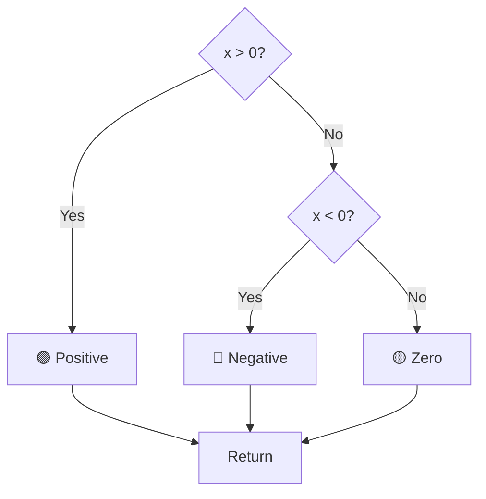

#  一、McCabe 复杂度计算

😃 **McCabe 复杂度度量法**（也叫**环形复杂度 Cyclomatic Complexity**）是一种常见的代码复杂度度量方法，主要用于衡量程序的*
*可测试性**和**可维护性**。
---

## **📌 1. 计算 McCabe 复杂度的公式**

McCabe 复杂度（`V(G)`）的计算公式如下：

$$
V(G) = E - N + 2P
$$

$$
V(G) = 闭环数(循环个数) + 1
$$

其中：

- `E` = 控制流图中的 **边（Edges）**
- `N` = 控制流图中的 **节点（Nodes）**
- `P` = **连通分量**（通常对于一个程序 `P=1`，除非是多个不相连的代码块）

---

## **📌 3. 举例**

### **示例代码**

```java
public String exampleMethod(int x) {
    Sting result;
    if (x > 0) {
        result = "Positive";
    } else if (x < 0) {
        result = "Negative";
    } else {
        result = "Zero";
    }

    return result;
}
```

控制流如下：



$$
V(G) = E - N + 2P
$$
$$
V(G) = 7 - 6 + 2(1) = 3
$$

**最终复杂度：3**

---

## **📌 5. 总结**

- **McCabe 复杂度** 主要衡量代码的**路径数量**，影响测试和维护成本
- **核心公式**：`V(G) = E - N + 2P`

# 二、路径覆盖问题

## 🎯 流程图

<div style="text-align: center;">
  
</div>

## ✅ 条件覆盖（Decision-Condition Coverage）

### 🧠 定义：
该方法不仅要求**每个判定表达式的结果为 True 和 False 都至少出现一次**，还要求**表达式中的每个条件也独立地取过 True 和 False**。
- 举个路径：`A → B → C → D → E → G`

### 📉 优点：
- 测试用例数量远少于路径覆盖。
- 能更有效地发现由于条件组合错误而产生的缺陷。

---

## ✅ 路径覆盖（Path Coverage）

### 🧠 定义：
路径覆盖要求**测试用例能够覆盖程序中所有可能的执行路径**，即从程序入口到出口的所有可能路径都要被测试到。

### 🧪 测试用例数量：
路径覆盖的测试用例数量与**流程图中分支数量**和**路径的复杂度**成指数级增长。当存在循环或多个条件分支时，路径数量可能非常庞大，甚至是**不可控的**。

### ✔️ 所需路径包括：

1. `A → B → C → D → E → F → G` ✅
2. `A → B → C → D → G` ✅
3. `A → D → E → F → G` ✅
4. `A → D → G` ✅

---

### 📌 小结：

- 条件流程图的路径覆盖需要**所有独立路径的测试用例**，数量视分支复杂度而定；
- 判定-条件覆盖作为常用的白盒测试方法，更**实用**，可以用更少的测试用例覆盖更多逻辑。
