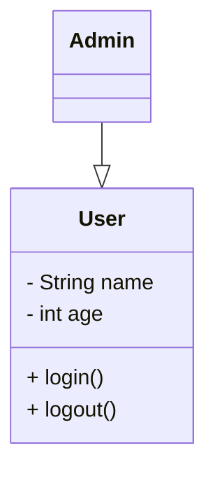
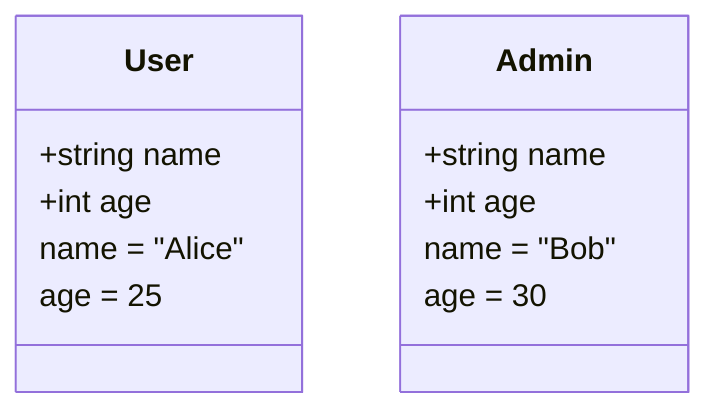
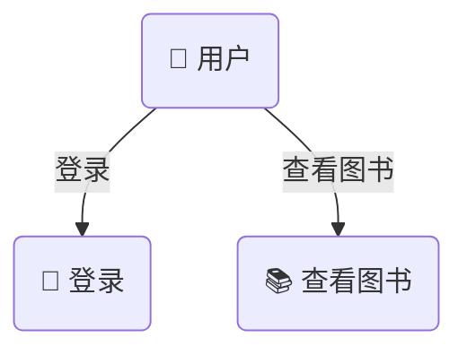
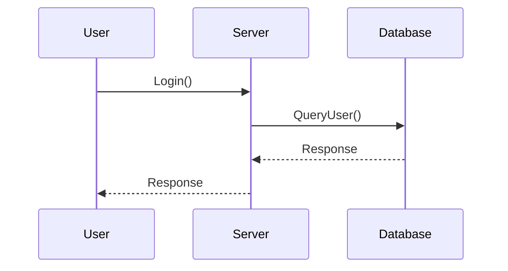
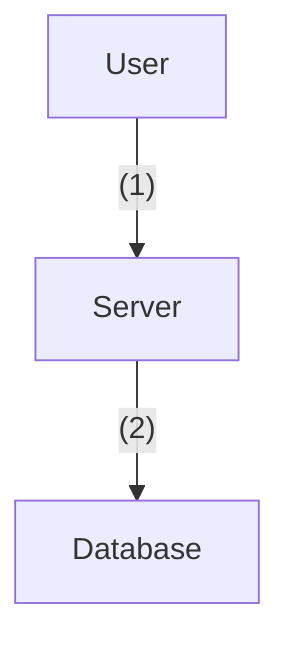
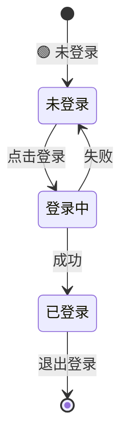
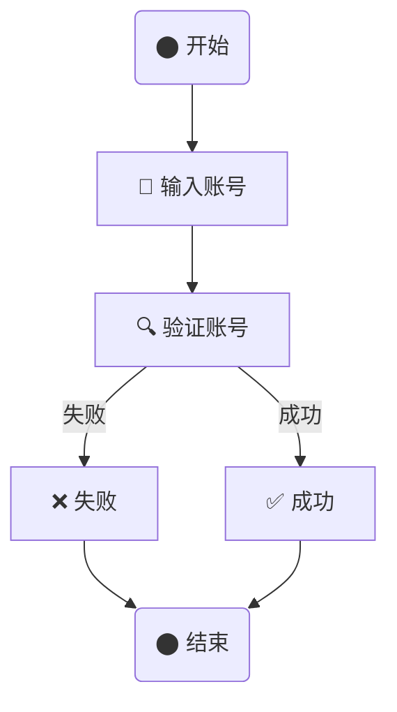
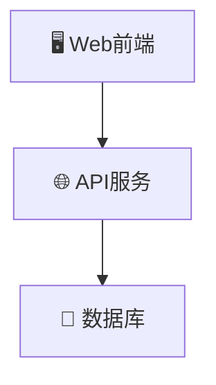
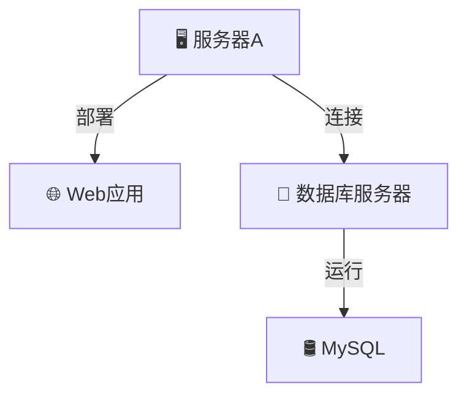

在UML（统一建模语言）中，不同的图有不同的用途和特点，以下是 **九种常见UML图** 的 **识别方法** 和 **区别**👇：

---

## 🔹 **1. 类图（Class Diagram）**

**🔍 识别特征：**

- 由 **类（Class）** 组成，每个类通常包含：
    - **类名**
    - **属性（变量）**
    - **方法（操作）**
- **类之间的关系**：
    - **继承（泛化）**：`A ◁——— B`，箭头指向父类
    - **实现（Realization）**：`A ◁---- B`，箭头指向接口
    - **关联（Association）**：`A <——— B`，箭头指向被关联类
        - **聚合（Aggregation）**：`A ◇——— B`，菱形指向整体，部分`可以独立`于整体存在
    - **组合（Composition）**：`A ◆——— B`，实心菱形指向整体，部分`不能独立`于整体存在

**✅ 适用场景**：

- 描述 **系统的静态结构**，比如类、接口、继承关系等。

**🛠 示例**

---

## 🔹 **2. 对象图（Object Diagram）**

**🔍 识别特征：**

- **类图的实例化版本**，展示 **对象（instance）** 及其 **具体数据**
- 通常包含 **对象名:类名**
- 关系与类图类似，但不涉及继承

**✅ 适用场景**：

- 展示系统运行时的 **具体实例数据**
- 调试类图的正确性

**🛠 示例**

---

## 🔹 **3. 用例图（Use Case Diagram）**

**🔍 识别特征：**

- **小人图标（Actor）** 代表 **用户**
- **椭圆（Use Case）** 代表 **功能**
- **箭头** 连接用户和功能，表示交互关系
- **泛化关系**表示用例之间的继承

**✅ 适用场景**：

- 描述 **系统的功能** 和 **用户交互**
- 适用于需求分析阶段

**🛠 示例**

---

## 🔹 **4. 序列图（Sequence Diagram）**

**🔍 识别特征：**

- 显示 **对象之间的交互顺序**
- **纵轴（时间轴）**，表示消息传递的时间顺序
- **水平箭头（消息）** 连接不同对象
- **`->` 同步调用，`-->` 异步调用**
- **返回消息** 用虚线 `--->`

**✅ 适用场景**：

- 详细描述 **某个功能的调用顺序**
- 适用于系统 **流程分析**

**🛠 示例**

---

## 🔹 **5. 通信图（Communication Diagram）**

**🔍 识别特征：**

- 又称 **协作图（Collaboration Diagram）**
- **对象（矩形）之间的交互**
- **箭头** 表示 **消息传递**
- **数字表示调用顺序**

**✅ 适用场景**：

- 关注 **对象间的通信** 而非时间顺序
- 类似于序列图，但更强调对象结构

**🛠 示例**

---

## 🔹 **6. 状态图（State Diagram）**

**🔍 识别特征：**

- 描述对象的 **状态变化**
- **圆角矩形** 代表 **状态**
- **箭头** 代表 **状态转移**
- **起始状态** (黑色圆点)，**终止状态** (黑圈+黑点)

**✅ 适用场景**：

- 分析 **对象的生命周期**
- 适用于 **工作流分析**

**🛠 示例**

---

## 🔹 **7. 活动图（Activity Diagram）**

**🔍 识别特征：**

- 类似 **流程图**
- **菱形** 表示 **条件分支**
- **箭头** 表示 **执行流程**
- **黑点** 表示 **开始**
- **黑圈+黑点** 表示 **结束**

**✅ 适用场景**：

- 适用于 **业务流程**
- 可用于 **算法设计**

**🛠 示例**

---

## 🔹 **8. 组件图（Component Diagram）**

**🔍 识别特征：**

- **长方形+文件符号（组件）**
- **连接线（接口）** 指示组件依赖关系

**✅ 适用场景**：

- 展示 **系统模块划分**
- 适用于 **软件架构设计**

**🛠 示例**

---

## 🔹 **9. 部署图（Deployment Diagram）**

**🔍 识别特征：**

- **服务器、设备（立方体）**
- **网络连接（箭头）**
- **软件组件** 部署在哪些设备上

**✅ 适用场景**：

- 适用于 **系统部署架构**
- 适用于 **物理硬件规划**

**🛠 示例**

---

## 🎯 **快速区分技巧**

| UML 图类型 | 主要关注点   | 适用场景  | 关键特点    |
|---------|---------|-------|---------|
| **类图**  | 类、继承关系  | 代码结构  | 三角箭头、菱形 |
| **对象图** | 对象实例    | 运行时状态 | 类图的具体实例 |
| **用例图** | 用户 & 功能 | 需求分析  | 小人+椭圆   |
| **序列图** | 调用顺序    | 交互流程  | 纵向时间轴   |
| **通信图** | 对象消息    | 交互分析  | 编号+箭头   |
| **状态图** | 状态变迁    | 业务逻辑  | 圆角矩形+箭头 |
| **活动图** | 流程控制    | 业务流程  | 菱形分支    |
| **组件图** | 组件关系    | 模块架构  | 矩形组件    |
| **部署图** | 服务器部署   | 硬件架构  | 服务器+连接线 |

---
